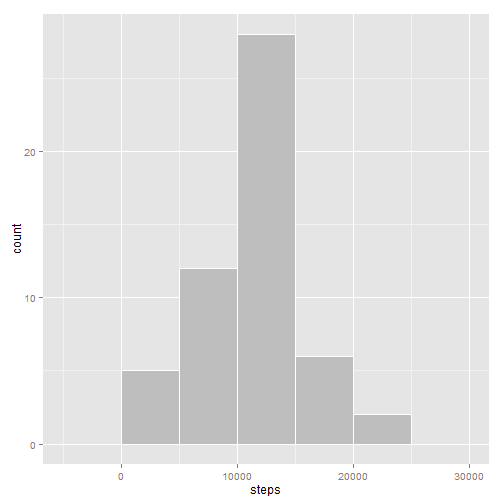
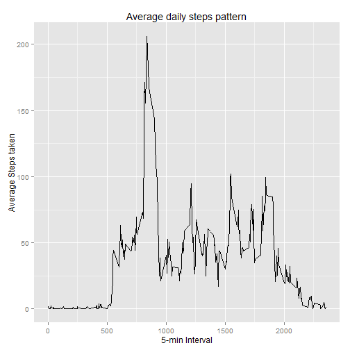
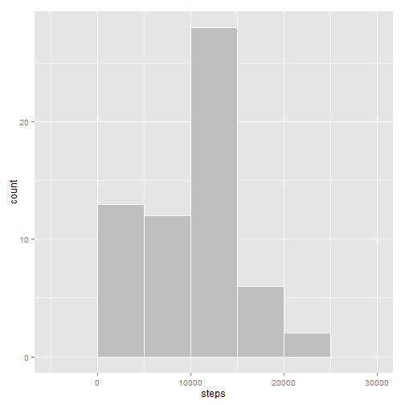
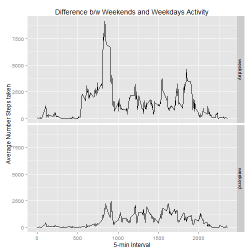

```r
library(ggplot2)
```

## Loading and preprocessing the data

```r
data <- read.csv(unz("activity.zip", "activity.csv"))
str(data)
```

```
## 'data.frame':	17568 obs. of  3 variables:
##  $ steps   : int  NA NA NA NA NA NA NA NA NA NA ...
##  $ date    : Factor w/ 61 levels "2012-10-01","2012-10-02",..: 1 1 1 1 1 1 1 1 1 1 ...
##  $ interval: int  0 5 10 15 20 25 30 35 40 45 ...
```

## What is mean total number of steps taken per day?

```r
dailystepcount <- aggregate(formula = steps ~ date, data = data, FUN = sum, na.rm = TRUE)
```
  
Mean of Daily step count

```r
mean(dailystepcount$steps)
```

```
## [1] 10766.19
```


Median of Daily step count

```r
median(dailystepcount$steps)
```

```
## [1] 10765
```

###Histogram for daily step counts

```r
g = ggplot(dailystepcount, aes(x=steps))
g = g + geom_histogram(binwidth=5000, color = "white", fill = "grey")
print(g)
```

 
  
## What is the average daily activity pattern?

```r
time_series<-aggregate(formula = steps ~ interval, data = data, FUN = mean, na.rm = TRUE)
g = ggplot(time_series, aes(x=interval, y = steps)) + geom_line()
g = g + xlab("5-min Interval") + ylab("Average Steps taken") + ggtitle("Average daily steps pattern")
print(g)
```

 

###Which 5-minute interval, on average across all the days in the dataset, contains the maximum number of steps?

```r
time_series[which.max(time_series$steps),]
```

```
##     interval    steps
## 104      835 206.1698
```
## Imputing missing values
Total number of missing values

```r
sum(is.na(data$steps))
```

```
## [1] 2304
```

###Impute the missing values
Strategy to impute : Take the overall average for the interval for which step count is missing. If an overall average is not available, then take 0 as step count.  

```r
#Filled data set
imputeddata<-data
for(i in 1:nrow(imputeddata))
{
  if(is.na(imputeddata[i,]$steps))
  {
    #take the mean of that interval as the replacement of NA value
    replace <- mean(time_series[imputeddata[i,]$interval,]$steps)
    
    #if there is no mean, it means there is absolutely no data on any 
    #day for that interval, then take 0 as step count
    if(is.na(replace)){
      replace = 0
    }
    
    imputeddata[i,]$steps = replace
  }
}
```

###Stats after imputing


```r
dailystepcount_imputed <- aggregate(formula = steps ~ date, data = imputeddata, FUN = sum)
daily_mean_imputed<-mean(dailystepcount_imputed$steps)
daily_median_imputed<-median(dailystepcount_imputed$steps)
```
  
Mean of Daily step count = 9544.5790288  
Median of Daily step count = 1.0395 &times; 10<sup>4</sup>

```r
g = ggplot(dailystepcount_imputed, aes(x=steps))
g = g + geom_histogram(binwidth=5000, color = "white", fill = "grey")
print(g)
```

 

###Impact imputing data
1.  Counts in some buckets have increased
2.  Increase very prominent in the lowest bucket i.e. (0-5000)
This could indicate some issues while collecting smaller step counts


## Are there differences in activity patterns between weekdays and weekends?

###Get the extra column to indicate whether it is a weekday or weekend

```r
imputeddata$date <- as.Date(imputeddata$date)

#write a function to get whether it is weekend or weekday
getday<-function(date)
{
  day = "";
  if(grepl("Saturday|Sunday",weekdays(date)))
  {
    day = "weekend";
  }
  else
  {
    day = "weekday"
  }
  day;
}

imputeddata$day <-sapply(imputeddata$date, getday)
head(imputeddata)
```

```
##       steps       date interval     day
## 1 0.0000000 2012-10-01        0 weekday
## 2 0.0754717 2012-10-01        5 weekday
## 3 1.4716981 2012-10-01       10 weekday
## 4 0.1509434 2012-10-01       15 weekday
## 5 0.1698113 2012-10-01       20 weekday
## 6 0.0000000 2012-10-01       25 weekday
```

###Panel Plot for weekdays and weekends

```r
time_series_withday <- aggregate(formula = steps ~ interval+day, data = imputeddata, FUN = sum, na.rm = TRUE)

g = ggplot(time_series_withday, aes(x=interval, y = steps)) + geom_line()
g = g + xlab("5-min Interval") + ylab("Average Number Steps taken") + ggtitle("Difference b/w Weekends and Weekdays Activity")
g = g + facet_grid(day~.)
print(g)
```

 
